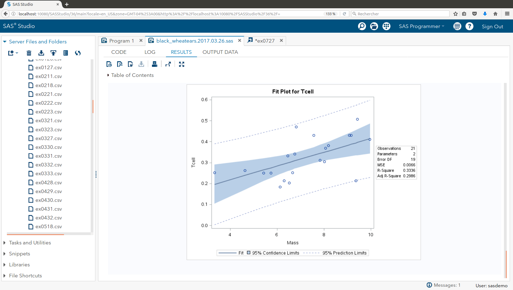
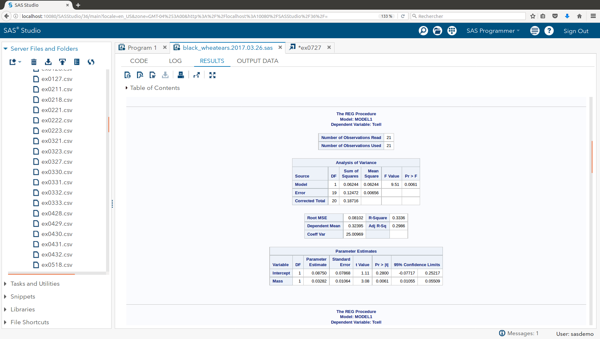
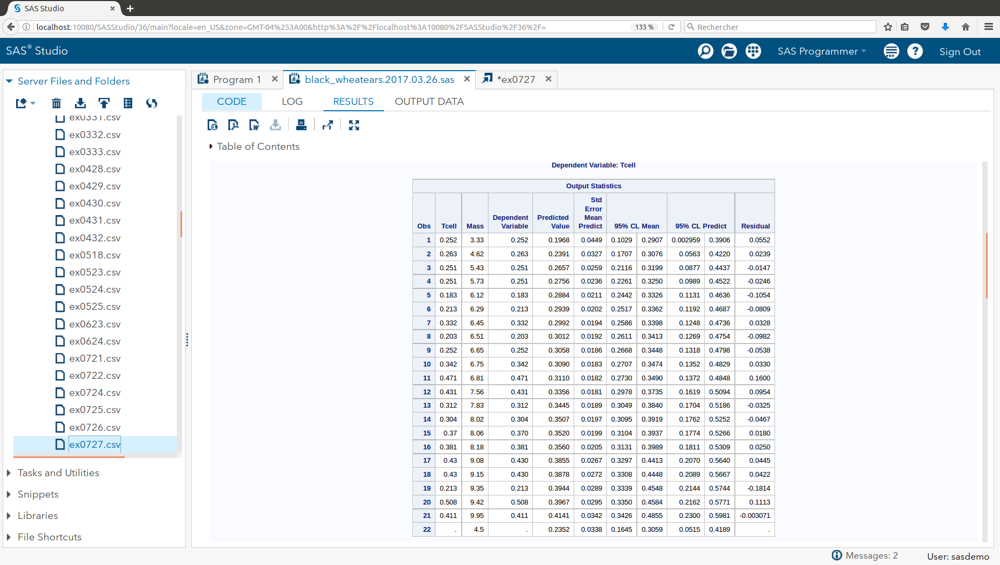
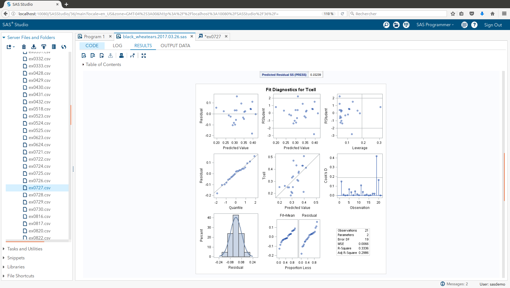

```{r setup, include=FALSE}
knitr::opts_chunk$set(echo = TRUE)
```

## Black WheatEars


```{r read in data set, echo = FALSE}

HOME_DIR <- "/home/mcdevitt/_smu/_src/black_wheatears"

DATA_DIR <- "./data/"

setwd(HOME_DIR)
setwd(DATA_DIR)

df_bw <- read.csv("ex0727.csv", stringsAsFactors = FALSE)

df_bw_overest_dist <- read.csv("ex0729.csv", stringsAsFactors = FALSE)

names(df_bw) <- tolower(names(df_bw))

```

### Homework 10 - Problem Set

#### b. Analyze the data providing at least the following:    

=-=-=-=-=-=-=-=-=-=-=-=-=-=-=-=-=-=-=-=-=-=-=-=-=-=-=-=-=-=-=-=-=-=-=-=--=-=-=-  
i. A Scatterplot with confidence intervals of the regression line and prediction intervals of the regression line.  Please do in SAS and R!    
```{r, echo = FALSE}


fit_all <- lm(tcell ~ mass, data = df_bw)

df_bw_conf_int <- as.data.frame(predict(fit_all, df_bw , interval = "confidence"))

plot(df_bw$tcell ~ df_bw$mass, col = 'blue', pch = 19, ylim = c(0, 0.6))
polygon(c(df_bw$mass, rev(df_bw$mass)),
		c(df_bw_conf_int$lwr, rev(df_bw_conf_int$upr)),col="lightgrey")

lines(fit_all$fitted.values ~ df_bw$mass, col = 'black', lwd = 4, lty = 3)

lines(df_bw_conf_int$lwr ~ df_bw$mass, col = 'black', lwd = 1)
lines(df_bw_conf_int$upr ~ df_bw$mass, col = 'black', lwd = 1)

points(df_bw$tcell ~ df_bw$mass, col = 'blue', pch = 19)

df_bw_pred_int <- as.data.frame(predict(fit_all, df_bw, interval = "predict"))

lines(df_bw_pred_int$lwr ~ df_bw$mass, col = 'grey', lwd = 1, lty = 2)
lines(df_bw_pred_int$upr ~ df_bw$mass, col = 'grey', lwd = 1, lty = 2)

```

And the SAS plot ...



  
=-=-=-=-=-=-=-=-=-=-=-=-=-=-=-=-=-=-=-=-=-=-=-=-=-=-=-=-=-=-=-=-=-=-=-=--=-=-=-  
ii. A table showing the t-statistics and pvalues for the significance of the regression parameters: .   Please do in SAS and R!  

```{r plot, echo=FALSE}

summary(fit_all)

```

And the SAS table ...




=-=-=-=-=-=-=-=-=-=-=-=-=-=-=-=-=-=-=-=-=-=-=-=-=-=-=-=-=-=-=-=-=-=-=-=--=-=-=-  
iii. Using the data in ii show all 6 steps of each hypothesis test.   
=-=-=-=-=-=-=-=-=-=-=-=-=-=-=-=-=-=-=-=-=-=-=-=-=-=-=-=-=-=-=-=-=-=-=-=--=-=-=-  

##### __Six-Step Hypothesis Test - Slope__   

``` {r, echo = FALSE}

alpha <- 0.05
dof <- dim(df_bw)[1] - 2
crit_value <- qt(1 - alpha/2, dim(df_bw)[1] - 2)

t_value <- coef(summary(fit_all))["mass","t value"]
p_value <- coef(summary(fit_all))["mass","Pr(>|t|)"]

if (p_value < alpha)
{
	acc_rej <- "Reject Ho"
	is_is_not <- "is"
	does_does_not <- "does not"
} else {
	acc_rej <- "Do not Reject Ho"
	is_is_not <- "is not"
	does_does_not <- "does"
}

cnf_intrvl <- confint(fit_all, 'mass', level = 1 - alpha)
cnf_intrvl_lwr <- cnf_intrvl[1,1]
cnf_intrvl_upr <- cnf_intrvl[1,2]

print_cnf_intrvl <- paste0(sprintf("(%9.3f", cnf_intrvl_lwr), sprintf(", %9.3f)", cnf_intrvl_upr))

```

1: Ho : b1 = 0; Ha ; b1 != 0  
2 : Critical Value : t(0.975, df = __`r dof `__) = +/- __`r crit_value`__   
3 : t = `r t_value `    
4 : p_value = `r p_value` < 0.05 ?    
5: `r acc_rej`  
6 : There `r is_is_not` sufficient evidence to suggest at the alpha = `r alpha` level of significance (p-value = `r p_value`) that the slope of the regression line that estimates the T cell for Black Wheatears based on the mass of the birds `r is_is_not` equal to zero. A `r (1 - alpha)*100`% confidence interval for the slope is `r print_cnf_intrvl`, which is an interval that `r does_does_not` contain the value zero  
  

##### __Six-Step Hypothesis Test - Intercept__   

``` {r, echo = FALSE}

alpha <- 0.05
dof <- dim(df_bw)[1] - 2
crit_value <- qt(1 - alpha/2, dim(df_bw)[1] - 2)

t_value <- coef(summary(fit_all))["(Intercept)","t value"]
p_value <- coef(summary(fit_all))["(Intercept)","Pr(>|t|)"]

if (p_value < alpha)
{
	acc_rej <- "Reject Ho"
	is_is_not <- "is"
	does_does_not <- "does not"
} else {
	acc_rej <- "Do not Reject Ho"
	is_is_not <- "is not"
	does_does_not <- "does"
}

cnf_intrvl <- confint(fit_all, '(Intercept)', level = 1 - alpha)
cnf_intrvl_lwr <- cnf_intrvl[1,1]
cnf_intrvl_upr <- cnf_intrvl[1,2]

print_cnf_intrvl <- paste0(sprintf("(%9.3f", cnf_intrvl_lwr), sprintf(", %9.3f)", cnf_intrvl_upr))

```

1 : Ho : b0 = 0; Ha ; b0 != 0  
2 : Critical Value : t(0.975, df = __`r dof `__) = +/- __`r crit_value`__   
3 : t = `r t_value `    
4 : p_value = `r p_value` < 0.05 ?    
5: `r acc_rej`  
6 : There `r is_is_not` sufficient evidence to suggest at the alpha = `r alpha` level of significance (p-value = `r p_value`) that the intercept of the regression line that estimates the T cell for Black Wheatears based on the mass of the birds is not equal to zero. A `r (1 - alpha)*100`% confidence interval for the slope is `r print_cnf_intrvl`, which is an interval that `r does_does_not` contain the value zero  
  


=-=-=-=-=-=-=-=-=-=-=-=-=-=-=-=-=-=-=-=-=-=-=-=-=-=-=-=-=-=-=-=-=-=-=-=--=-=-=-  
iv. The regression equation.  


``` {r, echo = FALSE}

b0 <- fit_all$coefficients[1]
b1 <- fit_all$coefficients[2]

```

The Regression equation : 
- Tcell = `r b1` * mass + `r b0`


=-=-=-=-=-=-=-=-=-=-=-=-=-=-=-=-=-=-=-=-=-=-=-=-=-=-=-=-=-=-=-=-=-=-=-=--=-=-=-  
v. Interpretation of the slope and intercept in the model (regression equation.)   

##### The slope represents the rate of change in Tcell estimated for a unit change in stone mass transported by this populations of birds sampled. I.e., for each increase in 1 gram of stone mass there is a corresponding increase in Tcell count of `r b1` 

##### The intercept represents the estimated average level of Tcell counts associated to a transported stone mass of 0 grams by this population of birds. From a practical point of view, since each bird evalauted did actually transport stones of some mass, the intercept provides an estimate of the lower bound of Tcell counts in this population of birds.

=-=-=-=-=-=-=-=-=-=-=-=-=-=-=-=-=-=-=-=-=-=-=-=-=-=-=-=-=-=-=-=-=-=-=-=--=-=-=-  
vi. Find and interpret the 95% confidence interval for the mean t-cell response conditional on a stone mass of 4.5 grams.  Please do in SAS and R!  

``` {r, echo = FALSE} 

cnf_intrvl <- predict(fit_all, data.frame(mass = 4.5) , interval = "confidence")
cnf_intrvl_lwr <- cnf_intrvl[1,2]
cnf_intrvl_upr <- cnf_intrvl[1,3]

print_cnf_intrvl <- paste0(sprintf("(%9.3f", cnf_intrvl_lwr), sprintf(", %9.3f)", cnf_intrvl_upr))

```

And the SAS table ...




The confidence interval is the upper and lower bound for the expected mean value at the given indpendent value (e.g., mass = 4.5 grams) for the current regression relationship.

For this particular regression, the confidence interval at stone mass = 4.5 : Tcell count in the range `r print_cnf_intrvl`
  
=-=-=-=-=-=-=-=-=-=-=-=-=-=-=-=-=-=-=-=-=-=-=-=-=-=-=-=-=-=-=-=-=-=-=-=--=-=-=-  
vii. Find and interpret the 95% prediction interval for the predicted t-cell response given a stone mass of 4.5 grams.   Please do in SAS and R!  


``` {r, echo = FALSE} 

prd_intrvl <- predict(fit_all, data.frame(mass = 4.5) , interval = "predict")
prd_intrvl_lwr <- prd_intrvl[1,2]
prd_intrvl_upr <- prd_intrvl[1,3]

print_prd_intrvl <- paste0(sprintf("(%9.3f", prd_intrvl_lwr), sprintf(", %9.3f)", prd_intrvl_upr))

```


The prediction interval is the upper and lower bound for an 'next' observation of dependent value at the given independent value, based on the current regression relationshhip. That is to say, for an observation of mass and tcell not included in this analysis, the prediction interval bounds the range of future observations that are expected.  

For this particular case, the prediction interval at stone mass = 4.5 : Tcell count in the range `r print_prd_intrvl`


=-=-=-=-=-=-=-=-=-=-=-=-=-=-=-=-=-=-=-=-=-=-=-=-=-=-=-=-=-=-=-=-=-=-=-=--=-=-=-  
viii. Using the graphical method, find and interpret the calibration intervals for the t-cell response of 0.3. (Both for mean t-cell response and for a single t-cell response.   Please do in SAS and R!  (R: package investr)  

``` {r, echo = FALSE}

# ... create data frame with equal interval x-axis values

df_mass <- as.data.frame(seq(from = -4, to = 20, by = 0.1))
names(df_mass) <- "mass"

plot(df_bw$tcell ~ df_bw$mass,
	 col = 'blue',
	 pch = 1,
	 xlim = c(-2, 14),
	 ylim = c(0.0, 0.6)
	 )

abline(v = seq(-2, 14, 0.2), col = "gray", lty = 3)

polygon(c(df_bw$mass, rev(df_bw$mass)),
		c(df_bw_conf_int$lwr, rev(df_bw_conf_int$upr)),col="lightgrey")

lines(fit_all$fitted.values ~ df_bw$mass, col = 'black', lwd = 4, lty = 3)

lines(df_bw_conf_int$lwr ~ df_bw$mass, col = 'black', lwd = 1)
lines(df_bw_conf_int$upr ~ df_bw$mass, col = 'black', lwd = 1)

points(df_bw$tcell ~ df_bw$mass, col = 'blue', pch = 1, ylim = c(0, 0.6))

df_bw_pred_int <- as.data.frame(predict(fit_all, df_mass, interval = "predict"))

lines(df_bw_pred_int$lwr ~ df_mass$mass, col = 'grey', lwd = 1, lty = 2)
lines(df_bw_pred_int$upr ~ df_mass$mass, col = 'grey', lwd = 1, lty = 2)

abline(h = 0.3, col = "red")


# ... zoom in on upper pred interval

plot(df_bw$tcell ~ df_bw$mass,
	 col = 'blue',
	 pch = 1,
	 xlim = c(-2, 0),
	 ylim = c(0.25, 0.35)
	 )

abline(v = seq(-2, 14, 0.2), col = "gray", lty = 3)

polygon(c(df_bw$mass, rev(df_bw$mass)),
		c(df_bw_conf_int$lwr, rev(df_bw_conf_int$upr)),col="lightgrey")

lines(fit_all$fitted.values ~ df_bw$mass, col = 'black', lwd = 4, lty = 3)

lines(df_bw_conf_int$lwr ~ df_bw$mass, col = 'black', lwd = 1)
lines(df_bw_conf_int$upr ~ df_bw$mass, col = 'black', lwd = 1)

points(df_bw$tcell ~ df_bw$mass, col = 'blue', pch = 1, ylim = c(0, 0.6))

df_bw_pred_int <- as.data.frame(predict(fit_all, df_mass, interval = "predict"))

lines(df_bw_pred_int$lwr ~ df_mass$mass, col = 'grey', lwd = 1, lty = 2)
lines(df_bw_pred_int$upr ~ df_mass$mass, col = 'grey', lwd = 1, lty = 2)

abline(h = 0.3, col = "red")

# ... zoom in on lower pred interval

plot(df_bw$tcell ~ df_bw$mass,
	 col = 'blue',
	 pch = 1,
	 xlim = c(10, 14),
	 ylim = c(0.25, 0.35)
	 )

abline(v = seq(-2, 14, 0.2), col = "gray", lty = 3)

polygon(c(df_bw$mass, rev(df_bw$mass)),
		c(df_bw_conf_int$lwr, rev(df_bw_conf_int$upr)),col="lightgrey")

lines(fit_all$fitted.values ~ df_bw$mass, col = 'black', lwd = 4, lty = 3)

lines(df_bw_conf_int$lwr ~ df_bw$mass, col = 'black', lwd = 1)
lines(df_bw_conf_int$upr ~ df_bw$mass, col = 'black', lwd = 1)

points(df_bw$tcell ~ df_bw$mass, col = 'blue', pch = 1, ylim = c(0, 0.6))

df_bw_pred_int <- as.data.frame(predict(fit_all, df_mass, interval = "predict"))

lines(df_bw_pred_int$lwr ~ df_mass$mass, col = 'grey', lwd = 1, lty = 2)
lines(df_bw_pred_int$upr ~ df_mass$mass, col = 'grey', lwd = 1, lty = 2)

abline(h = 0.3, col = "red")

# ... zoom in on confidence interval

plot(df_bw$tcell ~ df_bw$mass,
	 col = 'blue',
	 pch = 1,
	 xlim = c(2, 8),
	 ylim = c(0.25, 0.35)
	 )

abline(v = seq(-2, 14, 0.2), col = "gray", lty = 3)

polygon(c(df_bw$mass, rev(df_bw$mass)),
		c(df_bw_conf_int$lwr, rev(df_bw_conf_int$upr)),col="lightgrey")

lines(fit_all$fitted.values ~ df_bw$mass, col = 'black', lwd = 4, lty = 3)

lines(df_bw_conf_int$lwr ~ df_bw$mass, col = 'black', lwd = 1)
lines(df_bw_conf_int$upr ~ df_bw$mass, col = 'black', lwd = 1)

points(df_bw$tcell ~ df_bw$mass, col = 'blue', pch = 1, ylim = c(0, 0.6))

df_bw_pred_int <- as.data.frame(predict(fit_all, df_mass, interval = "predict"))

lines(df_bw_pred_int$lwr ~ df_mass$mass, col = 'grey', lwd = 1, lty = 2)
lines(df_bw_pred_int$upr ~ df_mass$mass, col = 'grey', lwd = 1, lty = 2)

abline(h = 0.3, col = "red")
```


=-=-=-=-=-=-=-=-=-=-=-=-=-=-=-=-=-=-=-=-=-=-=-=-=-=-=-=-=-=-=-=-=-=-=-=--=-=-=-  
ix. Find the same calibration intervals analytically using the SE equations given in class and in the book (Version 3 page 194).    

```{r}

y_est <- 0.3
x_at_y_est <- (y_est - b0) / b1

x_at_y_est

se_at_y_est <- predict(fit_all, data.frame(mass = x_at_y_est), se.fit = TRUE)

se_ci_at_y_est <- se_at_y_est$se.fit / abs(b1)

alpha <- 0.05
dof <- dim(df_bw)[1] - 2
crit_value <- qt(1 - alpha/2, dim(df_bw)[1] - 2)

cal_est_at_y_est_upr <- x_at_y_est + crit_value * se_ci_at_y_est
cal_est_at_y_est_lwr <- x_at_y_est - crit_value * se_ci_at_y_est


# ...	calibration of predicted value

res_std_dev <- sigma(fit_all) * sigma(fit_all)

se_pi_at_y_est <- (sqrt (res_std_dev + se_at_y_est$se.fit * se_at_y_est$se.fit) ) / abs(b1)

cal_pi_est_at_y_est_upr <- x_at_y_est + crit_value * se_pi_at_y_est
cal_pi_est_at_y_est_lwr <- x_at_y_est - crit_value * se_pi_at_y_est


```


=-=-=-=-=-=-=-=-=-=-=-=-=-=-=-=-=-=-=-=-=-=-=-=-=-=-=-=-=-=-=-=-=-=-=-=--=-=-=-  
x. A scatterplot of residuals.    Please do in SAS and R!  

``` {r, echo = FALSE}

tcell_res = resid(fit_all)

plot(df_bw$mass, tcell_res, 
     pch = 19,
	 col = "blue",
	 ylab="Residuals",
	 xlab="Stone Mass", 
     main="Black Wheatears - Residual Plot") 
abline(0, 0)

```


=-=-=-=-=-=-=-=-=-=-=-=-=-=-=-=-=-=-=-=-=-=-=-=-=-=-=-=-=-=-=-=-=-=-=-=--=-=-=-  
xi. A histogram of residuals with normal distribution superimposed.  (from SAS).    


``` {r, echo = FALSE}


res_mean <- mean(tcell_res)
res_std <- sqrt(var(tcell_res))

hist(tcell_res, density=20, breaks = 10, prob = TRUE, 
     xlab="Stone Mass",
#	 ylim=c(0, 10), 
     main="Black Wheatears - Residuals")
curve(dnorm(x, mean = res_mean, sd = res_std),
	  col = "darkblue",
	  lwd = 2,
	  add = TRUE,
	  yaxt = "n")

```

And the SAS plots ...


  
